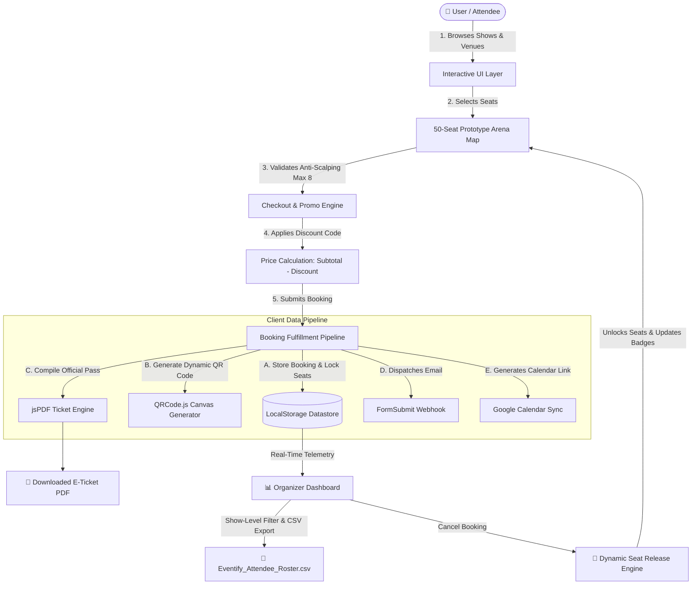

# 🎟️ Eventify Studio - Event Management & Ticketing Platform

[](https://github.com/manishtaware/eventify-studio)
[](https://github.com/manishtaware/eventify-studio)
[](https://github.com/manishtaware/eventify-studio)
[](https://github.com/manishtaware/eventify-studio)

> **Eventify Studio** is a full-featured event discovery, seat reservation, venue booking, and turnkey production management web application engineered for Pune, Maharashtra. It models the core architectural and interaction paradigms of platforms like **BookMyShow**, **Paytm Insider**, and **Zomato Live**.

---

## 📌 Table of Contents
1. [System Architecture & Data Flow](#-system-architecture--data-flow)
2. [📐 Full ER & UML Diagrams Specification](docs/ARCHITECTURE_AND_DIAGRAMS.md)
2. [Core Feature Breakdown](#-core-feature-breakdown)
3. [Security & Defensive Engineering](#-security--defensive-engineering)
4. [File Structure](#-file-structure)
5. [Professor & Viva Defense Guide](#-professor--viva-defense-guide)
6. [Production Scaling Roadmap](#-production-scaling-roadmap)

---

## 🏛️ System Architecture & Data Flow



---

## 🚀 Core Feature Breakdown

### 1. 50-Seat Interactive Arena Layout & Anti-Scalping Engine
* **Arena Layout**: 5 Rows (`Row A` through `Row E`) with 10 seats per row and an authentic **central walk-aisle** between seats 5 & 6.
* **Curved Stage Aesthetic**: Modern glowing theater/arena orientation screen.
* **Anti-Scalping Rule**: Enforces a strict maximum of **8 tickets per transaction**, preventing automated bulk hoarding.

### 2. Dynamic Seat Locking (Zero Double-Booking)
* Once seats (e.g., `A1, A2`) are booked for an event, they are committed to `localStorage`.
* Reopening the modal for that event permanently marks those seats as **Occupied (grayed out & disabled)**.
* Event cards dynamically decrement their remaining capacity badge (e.g., `38 / 50` $	o$ `36 / 50`) and update progress bars.

### 3. Promo Code & Coupon Engine
* Interactive checkout discount engine with real-time price breakdown:
  * `PUNE2026`: Flat **₹200 OFF** (minimum ₹1,000 cart)
  * `EVENTIFY50`: **15% OFF** (up to ₹500 discount)
  * `VIPPASS`: Flat **₹500 OFF** (minimum ₹2,500 cart)
* Itemized calculations persist to the booking record and are printed on the official pass.

### 4. Gate Entry E-Ticket with Scannable QR Code
* Generates an official, print-ready PDF e-ticket using **jsPDF** and **QRCode.js**.
* Embeds a scannable gate-entry QR code (`https://eventifystudio.com/verify?id=#EVT-XXXX`) directly onto the pass for gate bouncers and box-office scanning.

### 5. BookMyShow-Grade Organizer Control Center (`dashboards.html`)
* **Show-Level Telemetry**: Switch between aggregated Pune analytics or filter by individual show (e.g. AP Dhillon, Arijit Singh, Samay Raina).
* **Live KPI Counters**: Real-time Gross Revenue, Seats Sold, and Capacity Occupancy.
* **Live Attendee Roster**: Real-time table displaying attendee contact information, booked seats, and 1-click PDF re-generation.
* **CSV Export**: Download an `Eventify_Pune_Attendee_Roster.csv` spreadsheet with one click.

### 6. User Ticket Wallet & Pass Cancellation
* Users can view their active and past bookings in their personal ticket wallet.
* **Pass Cancellation**: Attendees can cancel their booking, which automatically releases their seats back into the available pool for that show.

### 7. Transparent Pune Venue Pricing & Facility Breakdown
* 8 partnered luxury venues across Pune (JW Marriott, Roots9, Phoenix Marketcity, Amanora, Pandit Farms, Pyramids Club, The Orchards, Conrad Pune).
* Explicit **5-point facility checklists** detailing power backups (DG sets), green rooms, valet parking, and acoustic sound setups included at that particular daily price.

---

## 🛡️ Security & Defensive Engineering

* **XSS Defense (Cross-Site Scripting)**:
  All user inputs (attendee name, contact, show title, seat numbers) pass through an `escapeHtml()` sanitization filter before interpolation into dynamic DOM templates. Payloads like `<script>` or `` are rendered safely as escaped HTML text (`&lt;script&gt;`).
* **HTML5 Constraint Validation**:
  Phone inputs enforce `pattern="[0-9]{10}"`, email fields validate RFC-compliant email formats, and booking dates restrict past date selection (`min="2026-09-07"`).
* **Safe Asynchronous Loading**:
  Loading screen features a multi-tiered fallback auto-dismiss mechanism (DOM ready, 600ms safety timeout, and click-to-skip) preventing page freezes.

---

## 📁 File Structure

```text
D:\eventify\
├── index.html        # Landing page (Hero, Stats, Shows preview, Venues, Services, Testimonials, FAQ)
├── events.html       # Concerts & Shows (Search, Filter, Tier comparison, Performer spotlight)
├── venues.html       # Pune Venues (Transparent rates, included facilities checklist, Leaflet map)
├── organize.html     # Custom Staging & Turnkey Management proposal booking forms
├── dashboards.html   # User Ticket Wallet & BookMyShow-style Organizer Dashboard
├── calendar.html     # Monthly event calendar with 1-click ticket checkout
├── gallery.html      # Event memories photo showcase with interactive lightbox
├── blogs.html        # Professional event production guides with in-modal article reader
├── contact.html      # Support inquiries, phone/email contact, and Pune headquarters info
├── categories.html   # Automatic redirect router to events.html
└── README.md         # Comprehensive engineering documentation & viva defense guide
```

---

## 🎓 Professor & Viva Defense Guide

When demonstrating this project to evaluators and professors, use this guide to explain design decisions:

### Q1: "Why is there no backend or database in this prototype?"
> **Answer**: *"This project is an advanced client-side frontend prototype designed to model platform workflows with zero external runtime dependencies. State management, seat locking, and live telemetry are handled using the browser's `localStorage` and client state machines. For full production deployment, the architecture transitions to a Node.js/Express REST API backed by PostgreSQL and Redis for distributed atomic locking."*

### Q2: "How would you prevent race conditions (double-booking) in production?"
> **Answer**: *"In this prototype, client-side seat locking marks booked seats as occupied across modals. In a multi-user production system, we would implement **distributed locking with Redis** or **row-level locks in PostgreSQL** (`SELECT ... FOR UPDATE`). When a user begins checkout, the seats enter a 10-minute temporary reservation lock while payment is processed."*

### Q3: "How is payment security handled?"
> **Answer**: *"In this prototype, the checkout mimics UPI, Net Banking, and Card workflows. For production, we would integrate payment gateways like Razorpay or Stripe using server-to-server **webhook signature verification (HMAC-SHA256)** to ensure tickets are only generated after confirmed bank capture."*

### Q4: "How do you protect against Cross-Site Scripting (XSS)?"
> **Answer**: *"Since attendee data is rendered dynamically into the wallet and organizer dashboard, we implemented an `escapeHtml()` sanitization filter that converts special characters (`<`, `>`, `&`, `"`, `'`) into safe HTML entities before DOM insertion, neutralizing malicious script injection."*

---

## 🗺️ Production Scaling Roadmap

| Tier | Component | Production Implementation |
| :--- | :--- | :--- |
| **Backend** | API Server | Node.js / Express or Python / FastAPI |
| **Database** | Relational Datastore | PostgreSQL / Supabase |
| **Cache & Locks**| Seat Concurrency | Redis (Atomic Expiring Keys) |
| **Payments** | Payment Gateway | Razorpay / Stripe (Webhook verification) |
| **Storage** | Ticket PDF Archival | AWS S3 / Cloudflare R2 |
| **Gate Entry** | Scanner Application | React Native / Flutter QR Code scanner app |

---

**Crafted with care for Eventify Studio Pune.**
