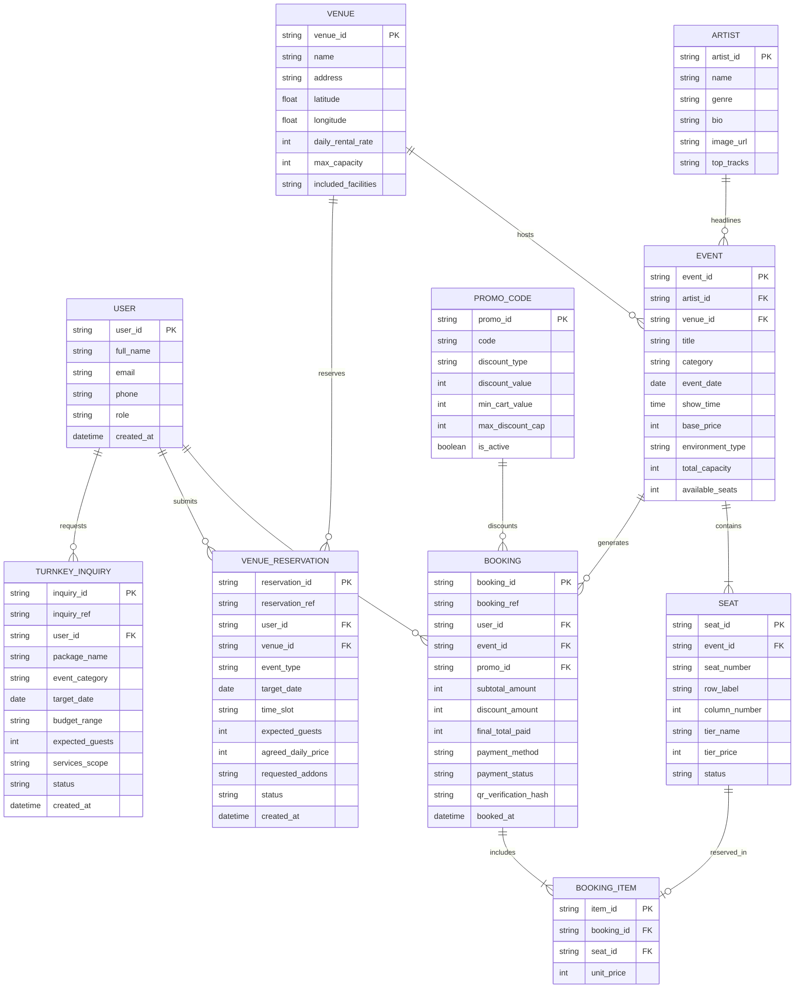
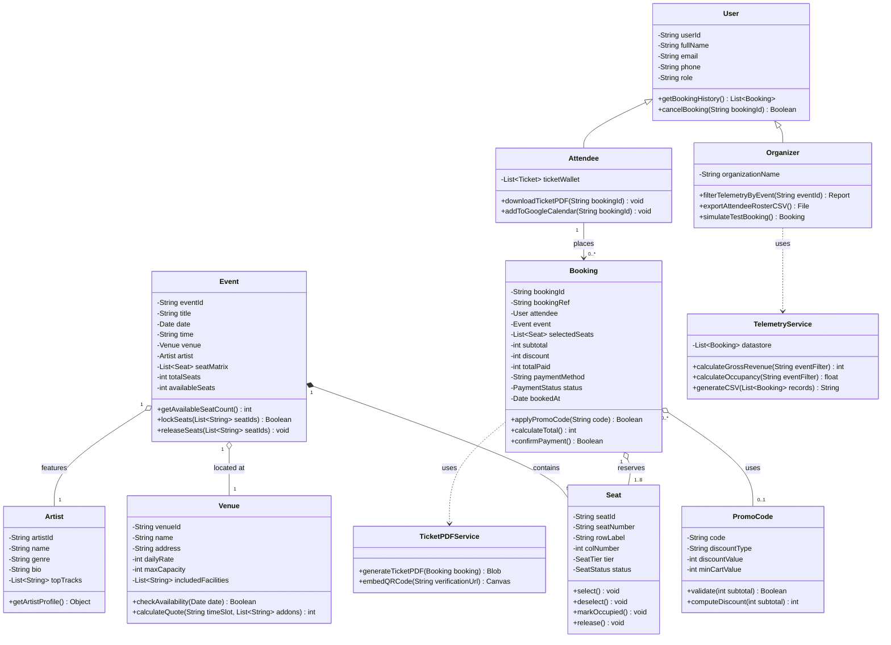
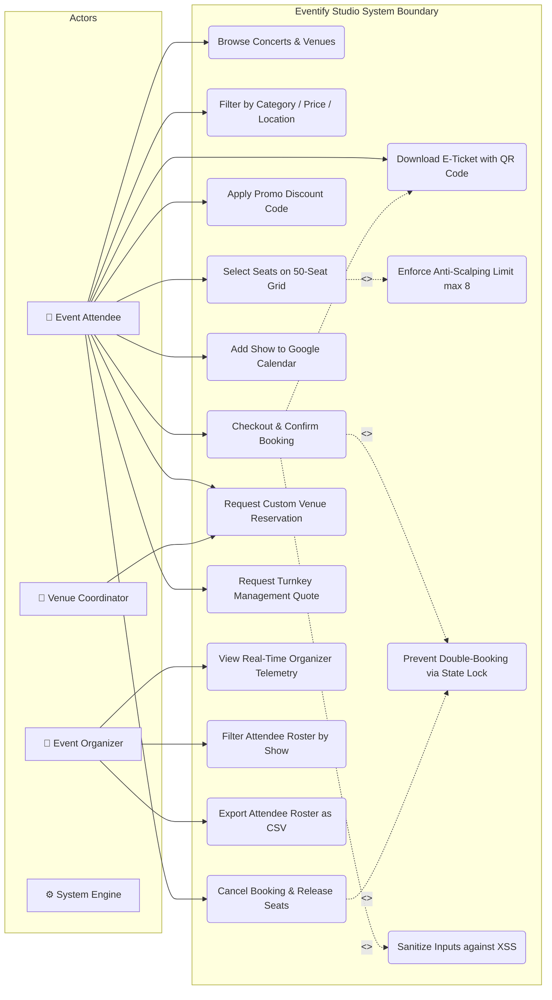
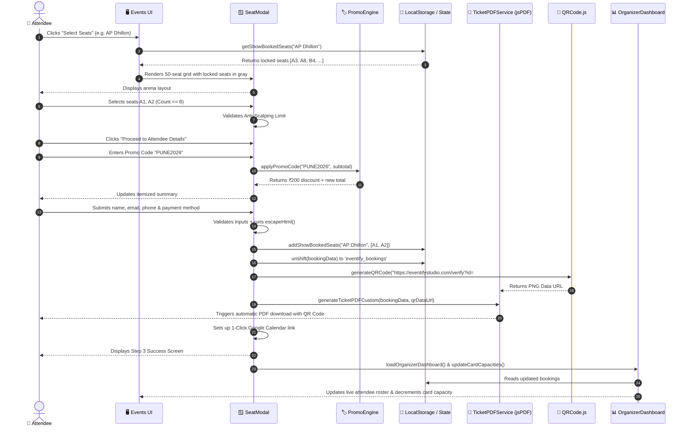
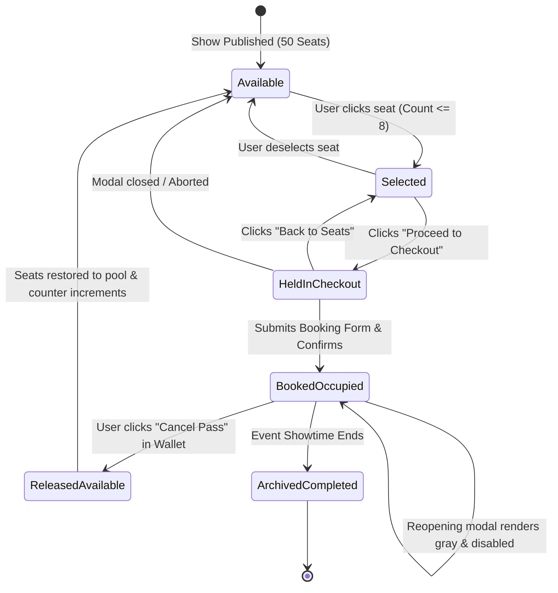

# 📐 Eventify Studio - ER & UML Architectural Diagrams

This document contains the complete set of **Entity-Relationship (ER)** and **Unified Modeling Language (UML)** engineering diagrams for **Eventify Studio**.

---

## 1. Entity-Relationship (ER) Diagram

The ER Diagram illustrates the relational data model, cardinalities, primary keys (PK), and foreign keys (FK) for the Eventify Studio platform.



---

## 2. UML Class Diagram

The UML Class Diagram shows the object-oriented system structure, attributes (with visibility and types), methods/operations, and relationships (inheritance, association, composition, aggregation).



---

## 3. UML Use Case Diagram

The Use Case Diagram defines the interactions between the primary actors (**Attendee**, **Event Organizer**, **Venue Coordinator**, and **System Engine**) and the system boundary.



---

## 4. UML Sequence Diagram (Seat Booking & QR Ticket Generation Flow)

This sequence diagram illustrates the step-by-step runtime interaction across UI, State Engine, Promo Engine, and PDF Generator during a booking transaction.



---

## 5. UML State Machine Diagram (Seat & Ticket Lifecycle)

Demonstrates all lifecycle transitions of a seat from initial creation to reservation, locking, confirmation, and release.



---

## 6. Relational Database Schema (SQL DDL for Production)

If your professor asks: *"How would this schema be implemented in a relational database like PostgreSQL or MySQL?"*, present this DDL:

```sql
-- 1. Users Table
CREATE TABLE users (
    user_id UUID PRIMARY KEY DEFAULT gen_random_uuid(),
    full_name VARCHAR(100) NOT NULL,
    email VARCHAR(150) UNIQUE NOT NULL,
    phone VARCHAR(15) NOT NULL,
    role VARCHAR(20) DEFAULT 'attendee' CHECK (role IN ('attendee', 'organizer', 'admin')),
    created_at TIMESTAMP WITH TIME ZONE DEFAULT CURRENT_TIMESTAMP
);

-- 2. Venues Table
CREATE TABLE venues (
    venue_id UUID PRIMARY KEY DEFAULT gen_random_uuid(),
    name VARCHAR(150) NOT NULL,
    location VARCHAR(200) NOT NULL,
    latitude DECIMAL(9,6),
    longitude DECIMAL(9,6),
    daily_rate INTEGER NOT NULL,
    max_capacity INTEGER NOT NULL,
    facilities_included TEXT[] NOT NULL
);

-- 3. Artists Table
CREATE TABLE artists (
    artist_id UUID PRIMARY KEY DEFAULT gen_random_uuid(),
    name VARCHAR(100) NOT NULL,
    genre VARCHAR(50) NOT NULL,
    bio TEXT,
    image_url TEXT
);

-- 4. Events Table
CREATE TABLE events (
    event_id UUID PRIMARY KEY DEFAULT gen_random_uuid(),
    artist_id UUID REFERENCES artists(artist_id) ON DELETE SET NULL,
    venue_id UUID REFERENCES venues(venue_id) ON DELETE RESTRICT,
    title VARCHAR(200) NOT NULL,
    event_date DATE NOT NULL,
    show_time TIME NOT NULL,
    base_price INTEGER NOT NULL,
    total_seats INTEGER DEFAULT 50,
    available_seats INTEGER DEFAULT 50,
    status VARCHAR(20) DEFAULT 'scheduled' CHECK (status IN ('scheduled', 'live', 'completed', 'cancelled'))
);

-- 5. Seats Table
CREATE TABLE seats (
    seat_id UUID PRIMARY KEY DEFAULT gen_random_uuid(),
    event_id UUID REFERENCES events(event_id) ON DELETE CASCADE,
    seat_number VARCHAR(10) NOT NULL,
    row_label CHAR(1) NOT NULL,
    col_number INTEGER NOT NULL,
    tier VARCHAR(20) DEFAULT 'Silver',
    price INTEGER NOT NULL,
    status VARCHAR(20) DEFAULT 'available' CHECK (status IN ('available', 'held', 'occupied')),
    UNIQUE (event_id, seat_number)
);

-- 6. Promo Codes Table
CREATE TABLE promo_codes (
    promo_id UUID PRIMARY KEY DEFAULT gen_random_uuid(),
    code VARCHAR(30) UNIQUE NOT NULL,
    discount_type VARCHAR(15) CHECK (discount_type IN ('flat', 'percentage')),
    discount_value INTEGER NOT NULL,
    min_cart_value INTEGER DEFAULT 0,
    max_discount_cap INTEGER,
    is_active BOOLEAN DEFAULT TRUE
);

-- 7. Bookings Table
CREATE TABLE bookings (
    booking_id UUID PRIMARY KEY DEFAULT gen_random_uuid(),
    booking_ref VARCHAR(30) UNIQUE NOT NULL,
    user_id UUID REFERENCES users(user_id) ON DELETE RESTRICT,
    event_id UUID REFERENCES events(event_id) ON DELETE RESTRICT,
    promo_id UUID REFERENCES promo_codes(promo_id) ON DELETE SET NULL,
    subtotal INTEGER NOT NULL,
    discount INTEGER DEFAULT 0,
    total_paid INTEGER NOT NULL,
    payment_method VARCHAR(50) NOT NULL,
    payment_status VARCHAR(20) DEFAULT 'confirmed' CHECK (payment_status IN ('pending', 'confirmed', 'refunded')),
    qr_hash VARCHAR(256),
    booked_at TIMESTAMP WITH TIME ZONE DEFAULT CURRENT_TIMESTAMP
);

-- 8. Booking Items Table
CREATE TABLE booking_items (
    item_id UUID PRIMARY KEY DEFAULT gen_random_uuid(),
    booking_id UUID REFERENCES bookings(booking_id) ON DELETE CASCADE,
    seat_id UUID REFERENCES seats(seat_id) ON DELETE RESTRICT,
    unit_price INTEGER NOT NULL,
    UNIQUE (booking_id, seat_id)
);

-- Index for concurrent seat-locking performance
CREATE INDEX idx_seats_event_status ON seats(event_id, status);
CREATE INDEX idx_bookings_user ON bookings(user_id);
```
